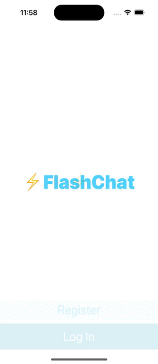
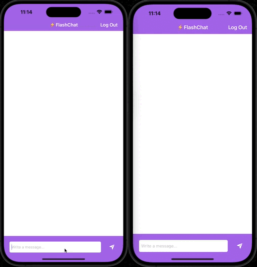

# Flash Chat

## What was do in this app

Flash Chat is an internet based messaging app. It is using a service called Firebase Firestore as a backend database to store and retrieve our messages from the cloud.

## What was used to make this app

* The Swift Programming Language
* Storyboard
* Firebase for user authentication, registration and login
* Work with UITableViews, set their data sources and delegates
* Integrate third party libraries using Swift Package Manager

## Example what the application do

